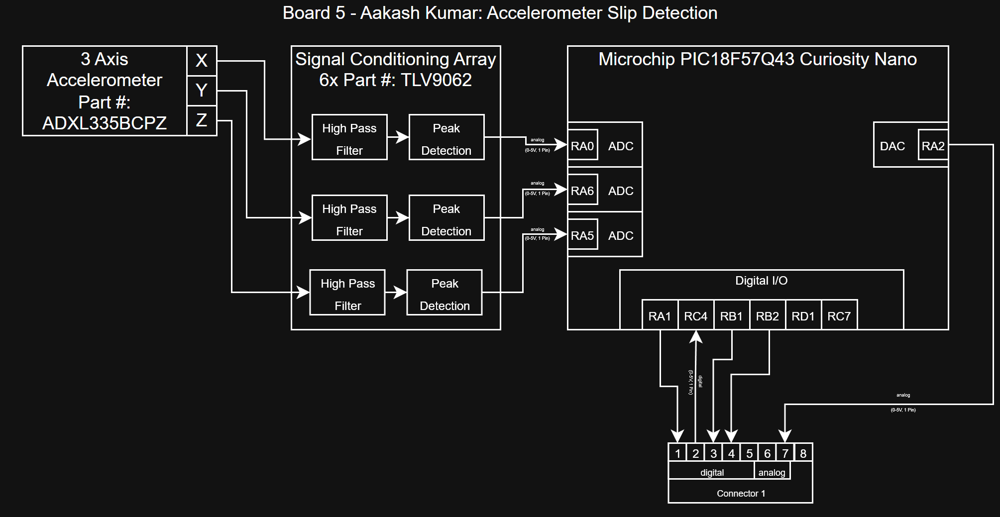

## Overview

Sensor: An ADXL335BCPZ will be used to capture 3-axis accelerometer captures motion and vibration data. The three signals are then ran through high-pass filters and peak detectors by using TLV9062 op-amps before entering the micro controller's ADC (RA0, RA6, RA5). 

Power Source: Power is provided through a regulated 3.3V line for the accelerometer and a 5V supply from the PIC18F57Q43 Curiosity Nano powers the signal conditioning array.

Team Connections: Connector 1 will run to our main hub (Sakiya: Board 1) which will then communicate the accelerometer slip detection data to the other boards to adjust the grip accordingly. Pins 1-4 provide digital feedback to the main control board.

## Block Diagram 

